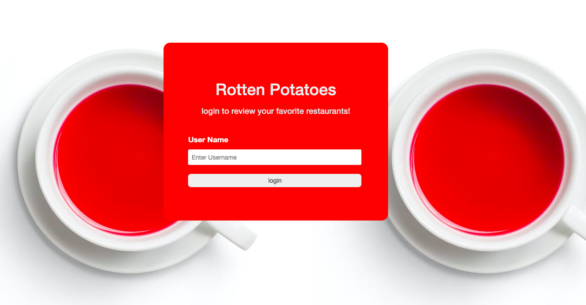
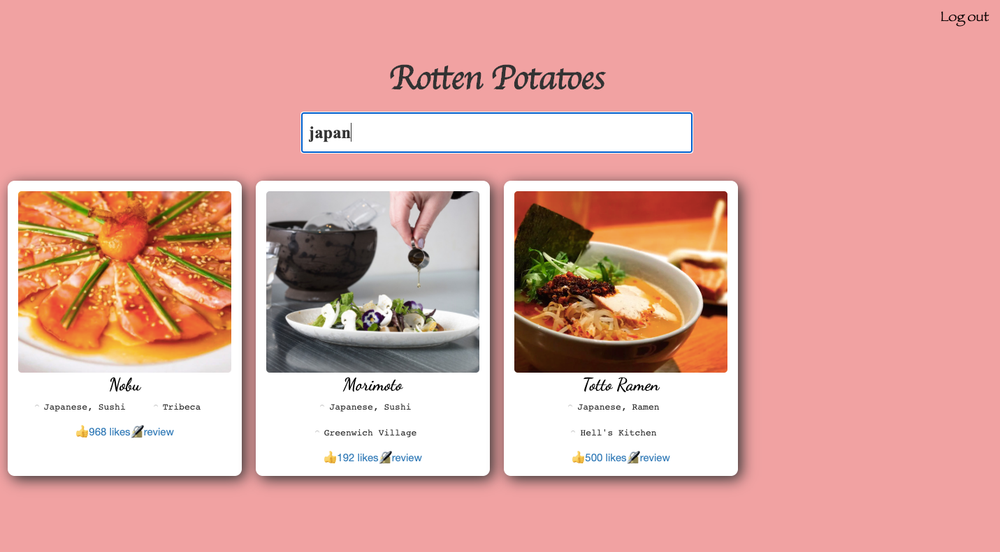

<h1>Rotten Potato</h1>

## [Table of Content](#top)
<ul>
  <li><a href="#about">About</a></li>
  <li><a href="#features">Features</a></li>
  <li><a href="https://jsapp-rotten-potatoes.herokuapp.com/">Live Site</a></li>
  <li><a href="#stacks">Stacks</a></li>
</ul>

## [About](#about)
  

  Rotten Potatoes is a local guide that offers New York residents a convenient means of discovering the most exceptional restaurants in their vicinity. Powered by the Zomato API, it simplifies the process of locating restaurants by enabling users to conduct searches based on location or name. Furthermore, the platform provides users with access to restaurant reviews authored by other diners and permits them to furnish feedback on their own dining experiences.
  

     

     

## [Features](#features)
  <ul>
      <li>Implemented JSON Web Tokens and Zomato API to enable users to review restaurants, creating a seamless user experience.</li>
      <li>Developed a robust Rails back-end to store user accounts, comments, and associations.</li>
      <li>Applied custom CSS, leveraging grid layout, modals, and CSS 2D animations, to create a visually appealing and engaging user interface.</li>
  </ul>

## [Stacks](#stacks)
  <ul>
    <li>JavaScript</li>
    <li>ROR backend</li>
    <li>CSS 2D animation and Bootstrap</li>
  </ul>

[Go back to top](#top)
